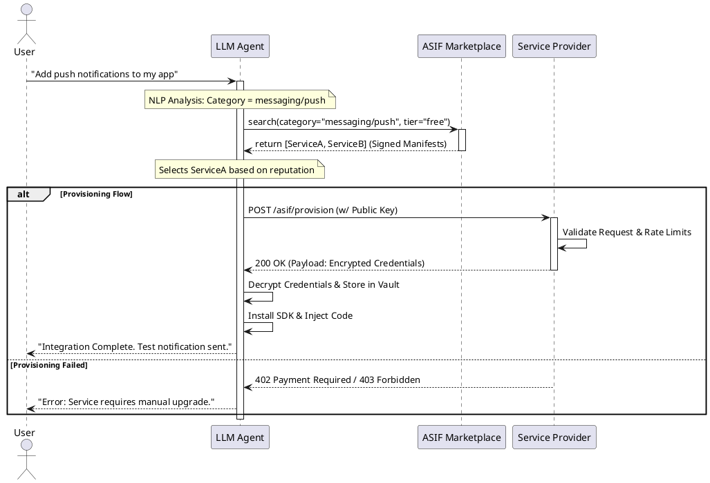
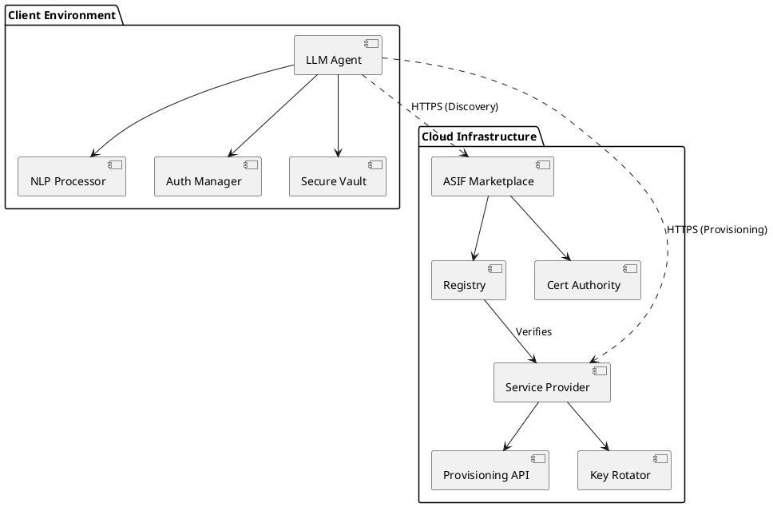
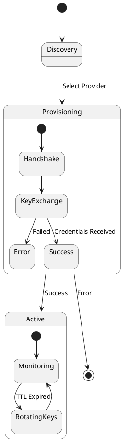

# ASIF Architecture

## Sequence Diagram: Zero-Touch Integration

```plantuml
@startuml
actor User
participant Agent as "LLM Agent"
participant Market as "ASIF Marketplace"
participant Service as "Service Provider"

User -> Agent: "Add push notifications to my app"
activate Agent
note over Agent: NLP Analysis: Category = messaging/push
Agent -> Market: search(category="messaging/push", tier="free")
activate Market
Market --> Agent: return [ServiceA, ServiceB] (Signed Manifests)
deactivate Market
note over Agent: Selects ServiceA based on reputation
alt Provisioning Flow
  Agent -> Service: POST /asif/provision (w/ Public Key)
  activate Service
  Service -> Service: Validate Request & Rate Limits
  Service --> Agent: 200 OK (Payload: Encrypted Credentials)
  deactivate Service
  Agent -> Agent: Decrypt Credentials & Store in Vault
  Agent -> Agent: Install SDK & Inject Code
  Agent --> User: "Integration Complete. Test notification sent."
else Provisioning Failed
  Service --> Agent: 402 Payment Required / 403 Forbidden
  Agent --> User: "Error: Service requires manual upgrade."
end
deactivate Agent
@enduml
```

## Component Diagram: Structural View

```plantuml
@startuml
package "Client Environment" {
  [LLM Agent] as Agent
  [NLP Processor]
  [Auth Manager]
  [Secure Vault]
  Agent --> [NLP Processor]
  Agent --> [Auth Manager]
  Agent --> [Secure Vault]
}
package "Cloud Infrastructure" {
  [ASIF Marketplace] as Market
  [Registry]
  [Cert Authority]
  Market --> [Registry]
  Market --> [Cert Authority]
  [Service Provider] as Service
  [Provisioning API]
  [Key Rotator]
  Service --> [Provisioning API]
  Service --> [Key Rotator]
}
Agent ..> Market : HTTPS (Discovery)
Agent ..> Service : HTTPS (Provisioning)
[Registry] --> [Service] : Verifies
@enduml
```

## State Machine: Service Instance Lifecycle

```plantuml
@startuml
[*] --> Discovery
Discovery --> Provisioning : Select Provider
state Provisioning {
  [*] --> Handshake
  Handshake --> KeyExchange
  KeyExchange --> Error : Failed
  KeyExchange --> Success : Credentials Received
}
Provisioning --> Active : Success
Provisioning --> [*] : Error
state Active {
  [*] --> Monitoring
  Monitoring --> RotatingKeys : TTL Expired
  RotatingKeys --> Monitoring
}
@enduml
```
